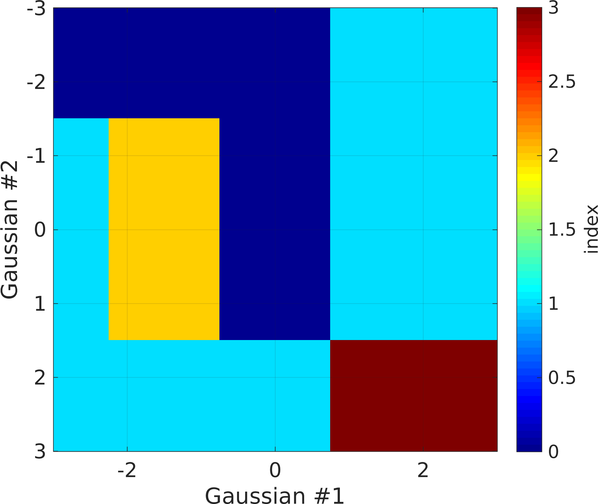

PluriGaussian - ND truncated Gaussian
-------------------------------------

Plurigaussian simulation is a type og truncated Gaussian simulation. It
works by generating a number of realizations of Gassuan models, each
with a sepcific choice of covariance model. Using a transformation map,
the Gaussian realizations are then converted into disrete units.

PluriGaussian based on 1 Gaussian
~~~~~~~~~~~~~~~~~~~~~~~~~~~~~~~~~

A simple example using 1 Gaussian realization, one must specify one
covariance model one plurigaussian transformation map through the two
fields ``prior{1}.pg_prior{1}.Cm``\ (or ``Cm``) and ``prior{1}.pg_map``.

The covariance model is defined as for any other Gaussian based models,
and can include anisotropy. In general, the variance (sill) should be 1.
Unless set othwerwise, the mean is assumed to be zero.

The values in the transformation map is implicitly assumed to define
boundaries along a linear scale from -3 to 3. As there are 7 entries
(see below) in the transformation map, each number in the transformation
map corresponds to [-3,-2,-1,0,1,2,3] respectively. The figure below
show what unit id's any Gaussian realized value will be transformed to.

::

    im=im+1;
    prior{im}.name='Plurigaussian'; % [optional] specifies name to prior
    prior{im}.type='plurigaussian';                % the type of a priori model
    prior{im}.x=[0:1:100];                 % specifies the scales of the 1st (X) dimension
    prior{im}.y=[10:1:90];                 % specifies the scales of the 2nd (Y) dimension
    prior{im}.Cm='1 Gau(10)'; % or next line
    prior{im}.pg_prior{1}.Cm=' 1 Gau(10)';
    prior{im}.pg_map=[0 0  1 1 0  2 2];
    [m,prior]=sippi_prior(prior);          % generate a realization from the prior model
    sippi_plot_prior_sample(prior,im,5)
    print_mul('prior_example_2d_plurigaussian_1')
    figure;
    pg_plot(prior{im}.pg_map,prior{im}.pg_limits);
    colormap(sippi_colormap);
    print_mul('prior_example_2d_plurigaussian_1_pgmap')

.. figure:: ../../figures/prior_example_2d_plurigaussian_1.png
   :alt: 

.. figure:: ../../figures/prior_example_2d_plurigaussian_1_pgmap.png
   :alt: Plurigaussian transformation map for 1 Gaussian realization

   Plurigaussian transformation map for 1 Gaussian realization

PluriGaussian based on 2 Gaussians
^^^^^^^^^^^^^^^^^^^^^^^^^^^^^^^^^^

Plurigaussian truncation can be based on more than one Gaussian
realization, In the example below, two Gaussian realization are used,
and therefore a transformation map needs to be defined. Each dimension
of the transformation map corresponds to values of the Gaussian
realization between -3 and 3. The transformation maps is visualized
below.

::

    im=1;
    prior{im}.name='Plurigaussian'; % [optional] specifies name to prior
    prior{im}.type='plurigaussian';                % the type of a priori model
    prior{im}.x=[0:1:100];                 % specifies the scales of the 1st (X) dimension
    prior{im}.y=[10:1:90];                 % specifies the scales of the 2nd (Y) dimension
    prior{im}.pg_prior{1}.Cm=' 1 Gau(10)';
    prior{im}.pg_prior{2}.Cm=' 1 Sph(10,35,.4)';
    prior{im}.pg_map=[0 0 0 1 1; 1 2 0 1 1; 1 1 1 3 3];
    [m,prior]=sippi_prior(prior);          % generate a realization from the prior model
    sippi_plot_prior_sample(prior,im,5)
    print_mul('prior_example_2d_plurigaussian_2')

    figure;
    pg_plot(prior{im}.pg_map,prior{im}.pg_limits);
    set(gca,'FontSize',16)
    colormap(sippi_colormap);
    print_mul('prior_example_2d_plurigaussian_2_pgmap') 

.. figure:: ../../figures/prior_example_2d_plurigaussian_2.png
   :alt: 

