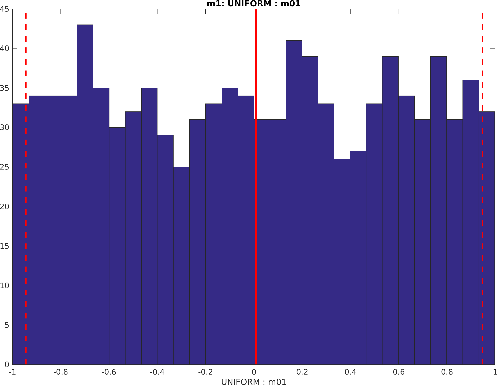
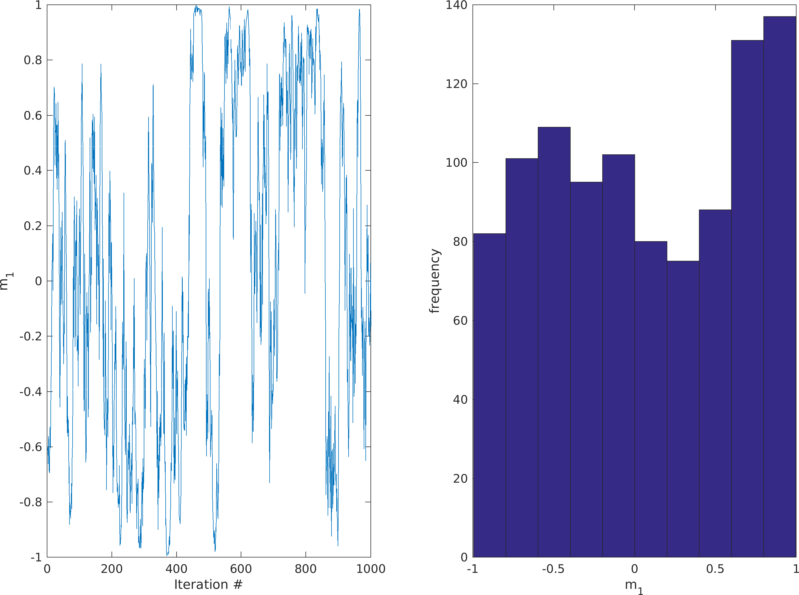

Uniform distribution
####################

A uniform prior model can be specified using the 'uniform' type prior
model

::

    prior{1}.type='uniform';

The only parameters needed are the minimum (``min``) and maximum
(``max``) values. A 1D uniform distribution between -1 and 1 can be
specified as

::

    prior{1}.type='uniform';
    prior{1}.min=-1;
    prior{1}.max=1;

Random walk using sequential Gibbs sampling
^^^^^^^^^^^^^^^^^^^^^^^^^^^^^^^^^^^^^^^^^^^

A random walk in the uniform prior (as in any supported prior type) can
be obtained using `sequential Gibbs sampling <SequentialGibbs.md>`__:

::

    %% seq gibbs
    prior{1}.seq_gibbs.step=0.2;
    N=1000;
    m_all=zeros(1,N);
    [m,prior]=sippi_prior(prior);     
    for i=1:1000;
         [m,prior]=sippi_prior(prior,m);
         m_all(i)=m{1};
         subplot(1,2,1);plot(1:i,m_all(1:i));
    end
    xlabel('Iteration #')
    ylabel('m_1')

Higher order model
""""""""""""""""""

By setting the ``x``, ``y``, and ``z`` parameter, a higher order prior
(uncorrelated) can be set. For example 3 independent model parameters
with a uniform prior distribution between 20 and 50, can be defined as

::

    prior{1}.type='uniform';
    prior{1}.x=[1 2 3];
    prior{1}.min=20;
    prior{1}.max=50;

Note that using the 'uniform' type priori model, is slightly more
computational efficient than using a '`gaussian <#prior_gaussian>`__'
type prior model with a high norm.
