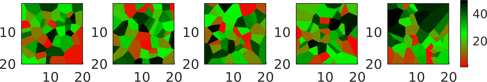
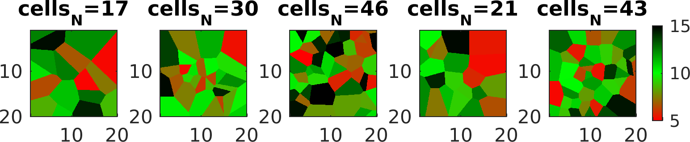

Voronoi
-------

The ``voronoi`` type defines a prior model defines an a priori model
based on a number of Voronoi cells. For example, a 2D model of size
(20x20) with 50 randomly located Voronoi cells can be defined using

::

    cells_N_max=50;    
    ip=1;
    prior{ip}.type='voronoi';    
    prior{ip}.x=1:.04:20;
    prior{ip}.y=1:.04:20;    
    prior{ip}.cells_N=cells_N_max; % SET NUMBER OF CELLS  
    prior{ip}.cells_N_min=3;
    prior{ip}.cells_N_max=cells_N_max;  
    sippi_plot_prior_sample(prior);

The value of each cell is simply an integer number between 1 and
``prior{ip}.cells_N``.

Randomize number of, location of, and value of the Voronois cells
~~~~~~~~~~~~~~~~~~~~~~~~~~~~~~~~~~~~~~~~~~~~~~~~~~~~~~~~~~~~~~~~~

The location and value of the Voronois cells can be randomized by
specifying additional, appropriately named a priori types.

For example to randomize location of the Voronoi cell define a number
prior models with names ``cells_x``, ``cells_y``, and ``cells_z`` (in
3D), as e.g.:

::

    ip=ip+1;
    prior{ip}.type='uniform';
    prior{ip}.name='cells_x';
    prior{ip}.x=[1:cells_N_max];
    prior{ip}.min=min(prior{1}.x);
    prior{ip}.max=max(prior{1}.x);
    prior{ip}.cax=[prior{ip}.min prior{ip}.max];
    prior{ip}.prior_master=1;

    ip=ip+1;
    prior{ip}.type='uniform';
    prior{ip}.name='cells_y';
    prior{ip}.x=[1:cells_N_max];
    prior{ip}.min=min(prior{1}.y);
    prior{ip}.max=max(prior{1}.y);
    prior{ip}.cax=[prior{ip}.min prior{ip}.max];
    prior{ip}.prior_master=1;

Finally, to randomize the value of each cell, define a prior with name
``cells_value``, as e.g.

::

    ip=ip+1;
    prior{ip}.type='uniform';
    prior{ip}.name='cells_value';
    prior{ip}.x=[1:cells_N_max];
    prior{ip}.min=5;
    prior{ip}.max=15;
    prior{ip}.prior_master=1;
    prior{1}.cax=[5 15];

Random walk using sequential Gibbs sampling
~~~~~~~~~~~~~~~~~~~~~~~~~~~~~~~~~~~~~~~~~~~

A random walk in the uniform prior (as in any supported prior type) can
be obtained using `sequential Gibbs sampling <SequentialGibbs.md>`__:

::

    for i=1:500;
        [m,prior]=sippi_prior(prior,m);
        sippi_plot_prior(prior,m);
        drawnow;
    end

This provides a video as e.g.: https://www.youtube.com/watch?v=doNhrDIjJpw

The code for the full example can be found here:
`prior\_reals\_voronoi.m <https://github.com/cultpenguin/sippi/blob/master/examples/prior_tests/prior_reals_voronoi.m>`__.
